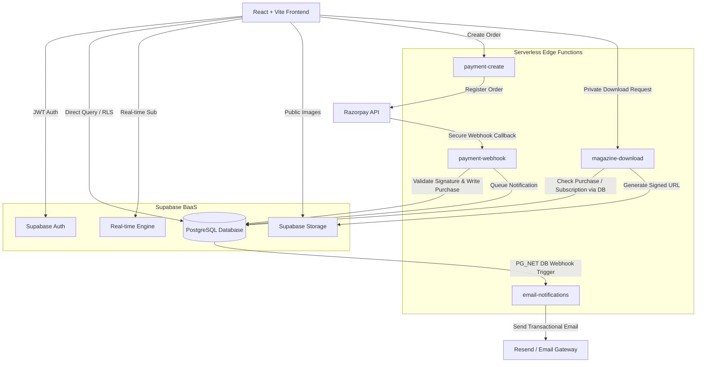
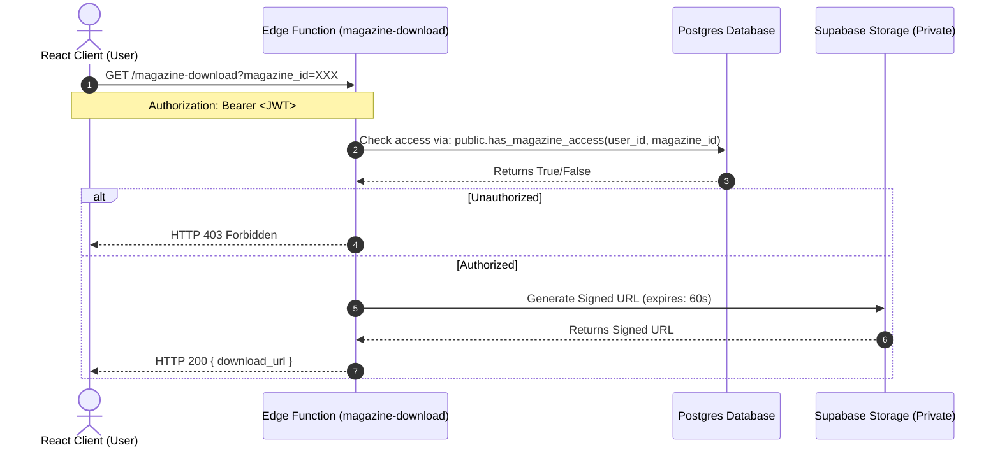
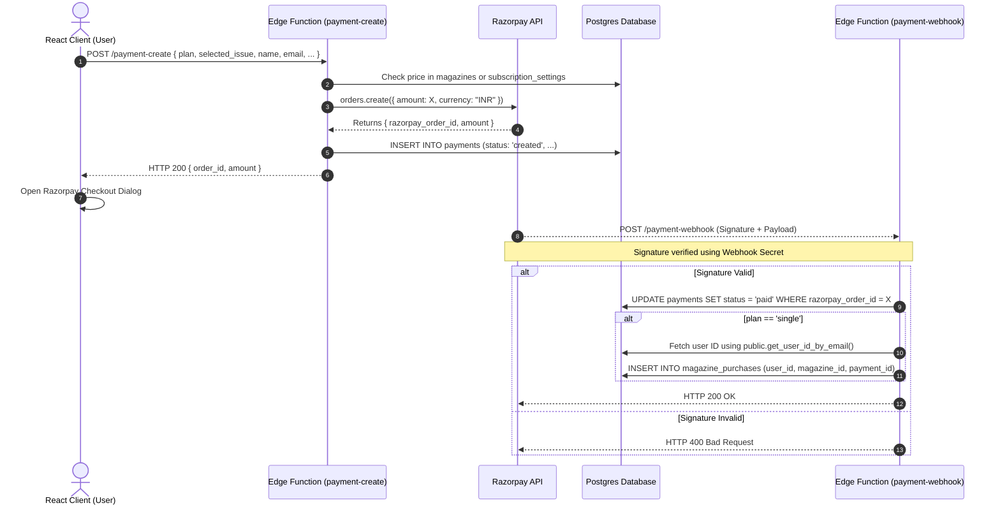

# The Art Ledger (TAL) - Backend Architecture Design
## Senior Backend Architect Blueprint (Aligned with Backup Schema)

This directory contains the complete backend architecture design, data models, API/workflows, and security structures for **The Art Ledger (TAL)**, fully aligned with the legacy database backup ([art-ledger-scroll-showcase_260710.backup](file:///c:/Users/ayush/OneDrive/Desktop/theal/bucket/art-ledger-scroll-showcase_260710.backup)).

---

### Executive Summary

The Art Ledger is an elite digital registry and publication platform for contemporary fine art, exhibitions, and curatorial commentary. The system is designed using a **Backend-as-a-Service (BaaS) and Serverless Hybrid Architecture** powered by **Supabase** and **Deno Edge Functions**. 

By leveraging managed PostgreSQL, Row Level Security (RLS) policies, Edge Functions, and external integrations like **Razorpay** (payments) and **Resend** (email notifications), the backend guarantees absolute integrity of transactional records, secure media delivery (signed PDF downloads), real-time engagement (comments and event reviews), and role-based permissions (Admins and Contributors mapped via `user_roles`) without the maintenance overhead of a custom VM or monolithic server.

This architecture is backward-compatible with the pre-existing schema structure, utilizing the identical database enums, tables, columns, indexes, and trigger functions found in the legacy dump.

---

## 1. Architecture Overview

### Core Architecture Style: BaaS + Serverless Hybrid

The architecture separates concerns between a client-rendered React + TypeScript SPA, a cloud-managed database/auth layer, and specialized serverless modules for payments, licensing, and email relays.

### Component Breakdown & Responsibilities

1. **Vite + React SPA**: Executes all user-facing logic, performs direct reads and writes to Supabase PostgreSQL (governed strictly by Row Level Security), manages client-side authentication states, and instantiates the Razorpay Checkout SDK.
2. **Supabase Auth**: Serves as the identity provider, issuing cryptographically signed JSON Web Tokens (JWT) containing user identifiers and profile metadata.
3. **Supabase PostgreSQL (Database Layer)**: Holds the state of the application. Leverages triggers to enforce data validation, generate slugs on article approvals, maintain contributor capacity constraints, and automatically sync authentication profiles.
4. **Supabase Storage**:
   - `public-assets` (including buckets like `magazine-covers` and `featured-profiles`): Houses public media served via global CDN.
   - `private-magazines` (specifically `magazine-pdfs`): Houses the premium magazine PDF editions. All read access is blocked at the bucket level; files can only be accessed via signed, short-lived URLs.
5. **Supabase Edge Functions**: Stateless Deno-based TypeScript environments running globally at the edge. They process secure, server-to-server computations (Razorpay integration, PDF license generation) and external REST API integrations.
6. **Supabase Realtime**: Broadcasts updates on commentary threads and blog submissions.

---

## 2. Core Services Layer

### Authentication & Authorization (RBAC)
Role-Based Access Control (RBAC) is implemented directly in PostgreSQL. Supabase Auth handles registrations and issues JWTs. A custom trigger `on_auth_user_created` maps newly authenticated users to a custom `profiles` table.

Privileges are checked via `user_roles` entries. System roles include:
- **`user`**: Default state. Can view public blogs, approved comments, preview magazine pages, and purchase issues.
- **`contributor`**: Mapped in `user_roles`. Authorized to submit blogs (`blog_submissions`), edit their own drafts, and manage their artist profile.
- **`admin`**: Mapped in `user_roles`. Holds full administrative privileges, bypasses RLS policies, reviews/approves blog submissions, manages events, and modifies global settings.

### Real-Time Pipeline
The client listens for real-time updates:
- **`blog_comments`**: Appending new comments to discussion threads instantly as curators engage.
- **`blog_submissions`**: Tracking review statuses.

### Row Level Security (RLS) and RPCs
Every table is locked down with RLS enabled. Clients query Supabase directly, but the PostgreSQL engine filters outputs based on the caller's JWT:
- **Read Blog Policy**: Anyone can select from `blog_submissions` where `status = 'approved'`. Only `admin` or the author can view drafts.
- **Access Verification**: Access to full magazine issues is audited via the database function `public.has_magazine_access(_user_id, _magazine_id)` which scans direct purchases and active subscription payment receipts.

---

## 3. Data Model & Database Schema

The database is built on PostgreSQL, utilizing custom schemas, foreign keys, constraints, and indexes optimized for search and filtering.

### Custom Types (Enums)
- **`app_role`**: `'admin'`, `'contributor'`
- **`blog_status`**: `'pending'`, `'approved'`, `'rejected'`, `'draft'`
- **`event_status`**: `'draft'`, `'published'`, `'completed'`
- **`magazine_status`**: `'draft'`, `'published'`, `'coming_soon'`
- **`profile_type`**: `'artist'`, `'curator'`
- **`share_status`**: `'pending'`, `'active'`, `'revoked'`, `'expired'`
- **`ad_enquiry_status`**: `'new'`, `'contacted'`, `'resolved'`

### Table Specifications

#### 1. Table: `profiles`
Extends the internal `auth.users` table, containing user-specific demographic details.
*Indexes: `idx_profiles_email` for email-based lookup.*

| Field Name | Data Type | Constraints | Description |
| :--- | :--- | :--- | :--- |
| `id` | `uuid` | `PRIMARY KEY`, `REFERENCES auth.users(id) ON DELETE CASCADE` | Matches the Supabase Auth user ID. |
| `email` | `text` | `CHECK (char_length(email) <= 255)` | User email. |
| `full_name` | `text` | `CHECK (char_length(full_name) <= 200)` | Full name of the user. |
| `created_at` | `timestamptz` | `DEFAULT now() NOT NULL` | Record creation timestamp. |
| `updated_at` | `timestamptz` | `DEFAULT now() NOT NULL` | Last modified timestamp. |

#### 2. Table: `user_roles`
Maps users to administrative roles.
*Unique constraint: `(user_id, role)` to prevent double mapping.*

| Field Name | Data Type | Constraints | Description |
| :--- | :--- | :--- | :--- |
| `id` | `uuid` | `PRIMARY KEY DEFAULT gen_random_uuid()` | Unique role mapping ID. |
| `user_id` | `uuid` | `NOT NULL REFERENCES auth.users(id) ON DELETE CASCADE` | User ID. |
| `role` | `app_role` | `NOT NULL` | Role enum (`'admin'`, `'contributor'`). |
| `created_at` | `timestamptz` | `DEFAULT now() NOT NULL` | Assigned timestamp. |

#### 3. Table: `payments`
Tracks transactions completed or initiated via the Razorpay payment gateway.
*Indexes: `idx_payments_order_id` for webhook verification queries.*

| Field Name | Data Type | Constraints | Description |
| :--- | :--- | :--- | :--- |
| `id` | `uuid` | `PRIMARY KEY DEFAULT gen_random_uuid()` | Internal transaction ID. |
| `name` | `text` | `NOT NULL` | Payer's full name. |
| `email` | `text` | `NOT NULL` | Payer's contact email. |
| `phone` | `text` | `NOT NULL` | Payer's contact phone number. |
| `plan` | `text` | `NOT NULL` | Membership plan or à-la-carte item (`'quarterly'`, `'annual'`, `'single'`). |
| `amount` | `numeric` | `NOT NULL` | Total transaction amount charged. |
| `razorpay_order_id` | `text` | `NULL UNIQUE` | Order ID generated by Razorpay. |
| `razorpay_payment_id` | `text` | `NULL UNIQUE` | Final transaction code (null until callback). |
| `razorpay_signature` | `text` | `NULL` | Verify payload authenticity. |
| `status` | `text` | `NOT NULL DEFAULT 'created'` | Payment status (e.g., `'created'`, `'paid'`, `'failed'`). |
| `address` | `text` | `NULL` | Shipping address (for print issues). |
| `city` | `text` | `NULL` | Shipping city. |
| `pincode` | `text` | `NULL` | Shipping postal code. |
| `country` | `text` | `DEFAULT 'India'` | Shipping country. |
| `selected_issue` | `text` | `NULL` | Linked magazine issue ID (for à-la-carte purchase). |
| `quantity` | `integer` | `DEFAULT 1` | Purchase quantity. |
| `shipping_fee` | `numeric` | `DEFAULT 0 NOT NULL` | Shipping charges applied. |
| `created_at` | `timestamptz` | `DEFAULT now() NOT NULL` | Order creation date. |
| `updated_at` | `timestamptz` | `DEFAULT now() NOT NULL` | Update timestamp. |

#### 4. Table: `magazines`
Holds publication metadata for digital and print magazine editions.
*Indexes: `idx_magazines_is_published` for customer catalogues.*

| Field Name | Data Type | Constraints | Description |
| :--- | :--- | :--- | :--- |
| `id` | `uuid` | `PRIMARY KEY DEFAULT gen_random_uuid()` | Unique issue ID. |
| `issue_number` | `integer` | `NOT NULL CHECK (issue_number >= 1)` | Numerical release sequence order. |
| `issue_name` | `text` | `NOT NULL` | Release title (e.g. `'Emerging Visions'`). |
| `slug` | `text` | `NOT NULL UNIQUE` | URL identifier. |
| `release_date` | `date` | `NOT NULL` | Publication date. |
| `tagline` | `text` | `CHECK (char_length(tagline) <= 500)` | Subtitle text. |
| `short_summary` | `text` | `CHECK (char_length(short_summary) <= 2000)` | Grid summary. |
| `long_description` | `text` | `CHECK (char_length(long_description) <= 10000)` | Main editorial summary. |
| `cover_image_url` | `text` | `NULL` | Public cover thumbnail. |
| `single_issue_price` | `numeric(10,2)`| `NOT NULL DEFAULT 0.00 CHECK (single_issue_price >= 0)` | Cost of a single issue. |
| `status` | `magazine_status`| `NOT NULL DEFAULT 'draft'` | Publication state. |
| `featured_artists` | `text[]` | `DEFAULT '{}'` | Array of artists featured in the issue (max 50). |
| `highlights` | `text[]` | `DEFAULT '{}'` | Key highlights of the issue (max 50). |
| `editor_note` | `text` | `CHECK (char_length(editor_note) <= 5000)` | Personal welcome note from the curator board. |
| `preview_page_count` | `integer` | `DEFAULT 5` | Number of preview pages allowed. |
| `preview_pdf_url` | `text` | `NULL` | Public preview PDF URL. |
| `total_page_count` | `integer` | `DEFAULT 0` | Total pages in the final print. |
| `preview_ranges` | `jsonb` | `DEFAULT '[]'::jsonb NOT NULL` | JSON array indicating page subsets allowed for review. |

#### 5. Table: `magazine_purchases`
Grants specific users access to specific digital magazine issues, purchased à la carte.
*Indexes: Composite `idx_user_magazine_license` (`user_id`, `magazine_id`) for immediate validation.*

| Field Name | Data Type | Constraints | Description |
| :--- | :--- | :--- | :--- |
| `id` | `uuid` | `PRIMARY KEY DEFAULT gen_random_uuid()` | Unique purchase token. |
| `user_id` | `uuid` | `NOT NULL REFERENCES auth.users(id) ON DELETE CASCADE` | Purchase owner. |
| `magazine_id` | `uuid` | `NOT NULL REFERENCES public.magazines(id) ON DELETE CASCADE` | Unlocked issue. |
| `payment_id` | `uuid` | `REFERENCES public.payments(id) ON DELETE SET NULL` | Linked payment transaction log. |
| `amount` | `numeric` | `NOT NULL DEFAULT 0` | Price paid. |
| `unlocked_at` | `timestamptz` | `DEFAULT now() NOT NULL` | Timestamp access was opened. |
| `created_at` | `timestamptz` | `DEFAULT now() NOT NULL` | Purchase creation date. |

#### 6. Table: `magazine_access_shares`
Allows buyers to share digital access slots with peers/colleagues (max 5).

| Field Name | Data Type | Constraints | Description |
| :--- | :--- | :--- | :--- |
| `id` | `uuid` | `PRIMARY KEY DEFAULT gen_random_uuid()` | Unique share code. |
| `purchase_id` | `uuid` | `NOT NULL REFERENCES public.magazine_purchases(id) ON DELETE CASCADE` | Linked parent purchase. |
| `magazine_id` | `uuid` | `NOT NULL REFERENCES public.magazines(id) ON DELETE CASCADE` | Unlocked issue. |
| `owner_user_id` | `uuid` | `NOT NULL REFERENCES auth.users(id) ON DELETE CASCADE` | Giver user ID. |
| `recipient_email` | `text` | `NOT NULL` | Recipient email. |
| `recipient_name` | `text` | `NULL` | Recipient name. |
| `recipient_phone` | `text` | `NULL` | Recipient phone. |
| `recipient_user_id` | `uuid` | `REFERENCES auth.users(id) ON DELETE SET NULL` | Recipient user ID (synced on signup). |
| `invite_token` | `text` | `NOT NULL` | Cryptographic share token. |
| `status` | `share_status` | `NOT NULL DEFAULT 'pending'` | Enum: `pending`, `active`, `revoked`, `expired`. |
| `expires_at` | `timestamptz` | `DEFAULT (now() + '30 days'::interval) NOT NULL` | Expiration limit of slot (defaults to 30 days). |

#### 7. Table: `blog_submissions`
Contains submitted essays, reviews, and editorial journals.

| Field Name | Data Type | Constraints | Description |
| :--- | :--- | :--- | :--- |
| `id` | `uuid` | `PRIMARY KEY DEFAULT gen_random_uuid()` | Unique article ID. |
| `name` | `text` | `NOT NULL` | Author full name. |
| `email` | `text` | `NOT NULL` | Author email address. |
| `title` | `text` | `NOT NULL` | Article title. |
| `content` | `text` | `NOT NULL` | Complete body text (Markdown/HTML). |
| `category` | `text` | `NOT NULL` | Curatorial category. |
| `image_url` | `text` | `NOT NULL` | Cover layout image URL. |
| `slug` | `text` | `UNIQUE` | Unique URL handle (auto-generated on approval). |
| `status` | `blog_status` | `NOT NULL DEFAULT 'pending'` | Enum: `draft`, `pending`, `approved`, `rejected`. |
| `admin_notes` | `text` | `NULL` | Administrative feedback notes. |
| `reviewed_by` | `uuid` | `REFERENCES public.profiles(id) ON DELETE SET NULL` | Admin profile reviewing the draft. |
| `published_at` | `timestamptz` | `NULL` | Timestamp set when article goes public. |

---

## 4. API & Serverless Workflow Design

All sensitive logic runs inside isolated **Supabase Edge Functions**. Below is the interface design and process workflow for key transactions.

### Workflow A: Magazine Access & Private Storage Delivery

This workflow prevents direct resource hotlinking by checking access rights in the DB and serving temporary access credentials.

### Workflow B: Payment Processing & Razorpay Webhooks

This architecture uses the Razorpay API with backend verification to prevent client-side payment forgery.

---

## 5. Security & Authorization Matrix

Supabase implements security via database-level **Row Level Security (RLS)**. It guarantees that even if a malicious client uses the public Supabase Client SDK, they cannot execute unauthorized queries.

### PostgreSQL Row Level Security (RLS) Rules

Below is the concrete configuration mapping for tables:

- **`profiles`**:
  - SELECT: `auth.uid() = id` (Users view own profile; denys anonymous SELECT).
  - INSERT: `auth.uid() = id`.
  - UPDATE: `auth.uid() = id`.
  - DELETE: `false` (Deny profile deletion).
- **`user_roles`**:
  - SELECT: `user_id = auth.uid()`.
  - INSERT/UPDATE/DELETE: `public.has_role(auth.uid(), 'admin'::public.app_role)`.
- **`magazines`**:
  - SELECT: `status = 'published'::public.magazine_status OR status = 'coming_soon'::public.magazine_status`.
  - INSERT/UPDATE/DELETE: `public.has_role(auth.uid(), 'admin'::public.app_role)`.
- **`magazine_purchases`**:
  - SELECT: `user_id = auth.uid()`.
  - INSERT/UPDATE/DELETE: `public.has_role(auth.uid(), 'admin'::public.app_role)`.
- **`blog_submissions`**:
  - SELECT: `status = 'approved' OR public.has_role(auth.uid(), 'contributor'::public.app_role)`.
  - INSERT: `public.has_role(auth.uid(), 'contributor'::public.app_role)`.
  - UPDATE: `author_email = auth.email() AND status = 'draft'`.
  - DELETE: `public.has_role(auth.uid(), 'admin'::public.app_role)`.
